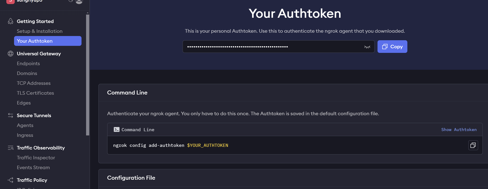

# Music Generator Web App

## Introduction
This project is a simple Music Generator Web Application where users can generate music by providing prompts and selecting keywords. 
The generated music can be played directly from the web interface, and a history of generated music is maintained for easy access.

## Features
- Generate music based on user prompts and keywords.
- Play generated music directly on the webpage.
- Maintain a list of previously generated music.
- Responsive design for user-friendly experience.

## Tech Stack
- **Backend**: Flask (Python)
- **Frontend**: HTML, CSS, JavaScript
- **Music Model**: Audiocraft's MusicGen
- **Environment**: Google Colab

## Usage Instructions

Follow these steps to access and use the Music Generator Web App hosted on Google Colab:

### 1. Access the Colab Notebook
- Open the Colab notebook by clicking on the provided link:
  [Colab Notebook Link](https://colab.research.google.com/drive/11Yi82YDL2XoeRhGQV2dR9hdVcUmUCZjn?usp=sharing)
- Enable GPU in Colab by selecting "Runtime" > "Change runtime type" > Set "Hardware accelerator" to "GPU".

---

### 2. Execute the Code
- Once inside the notebook, execute each code cell from the top to the bottom by clicking the **▶ (Run)** button on the left of each cell.
- This will:
  1. Install all required packages (e.g., PyTorch, Flask, ngrok).
  2. Download the necessary HTML, CSS, and JavaScript files from GitHub.

---

### 3. Configure ngrok
- To allow access to the web app, you need to configure ngrok:
  1. Get your **ngrok auth token** from [ngrok website](https://dashboard.ngrok.com/get-started/your-authtoken).
 
     
     
   
 
  2. Copy your token and paste it into the specific code cell where ngrok is configured:
     ```python
     !./ngrok authtoken YOUR_NGROK_AUTH_TOKEN
     ```
  3. Run the cell to authenticate your ngrok setup.

---

### 4. Start the Flask Server
- Execute the cell containing the Flask code to start the server.
- This will start the backend of the Music Generator Web App.

---

### 5. Access the Web Page
- Once the Flask server starts, a **public URL** will be generated by ngrok.
- Copy the URL (e.g., `http://1234-5678-91011.ngrok.io`) from the output of the Flask server cell.
- Paste the URL into your web browser to access the Music Generator Web App.

  

---

### **Additional Notes**
1. Ensure that you execute all code cells in the notebook to avoid errors.
2. If the ngrok URL expires (after 2 hours for free accounts), restart the server and ngrok setup.
3. The generated music files will appear in the **Generated Music List** on the web page.

Enjoy creating music!


## Usage

Follow these steps to use the Music Generator Web App:

1. **Enter a music prompt**:
   - In the input box labeled "Enter a music prompt," type a description of the kind of music you want.
   - For example:
     - "Relaxing acoustic guitar melody."
     - "Epic orchestral soundtrack."
     - "Calm jazz piano background."

2. **Set the duration**:
   - Choose the duration for the generated music using the input box labeled "Duration (seconds)."
   - You can select a value between **5** and **30 seconds**.

3. **Choose optional keywords**:
   - Click on the provided keyword buttons (e.g., "Acoustic", "Jazz", "Relaxing") to add additional styles or characteristics to your music prompt.

4. **Generate music**:
   - Click the **"Generate Music"** button to create your music. The system will process your input and generate a music file.

5. **View and play generated music**:
   - Once the music is generated, it will appear in the **"Generated Music List."**
   - Click on the file name in the list to play it using the audio player.

6. **Clear the prompt** (optional):
   - If you want to reset the prompt input, click the **"Clear Prompt"** button.

---

### Example Workflow:
- **Prompt**: "Calm and relaxing piano melody."
- **Duration**: 15 seconds.
- **Keywords**: "Piano", "Relaxing."
- **Generated Result**: A calming piano track ideal for a meditative session.


